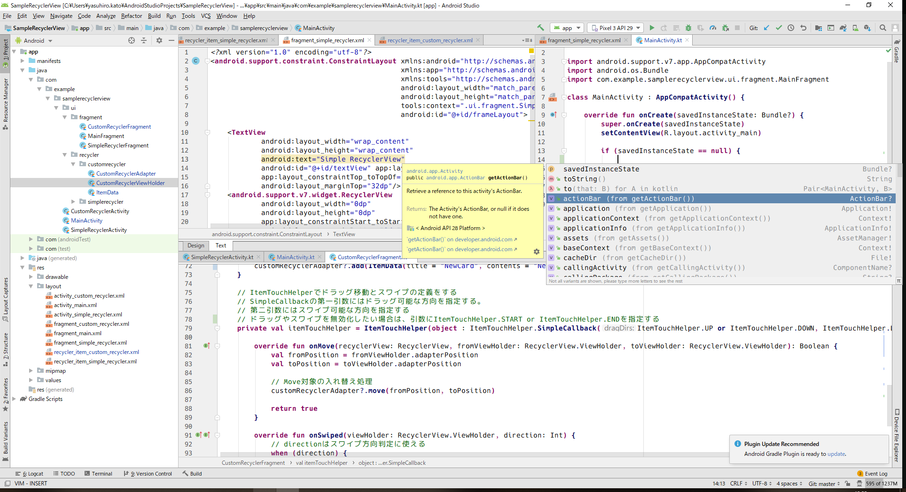
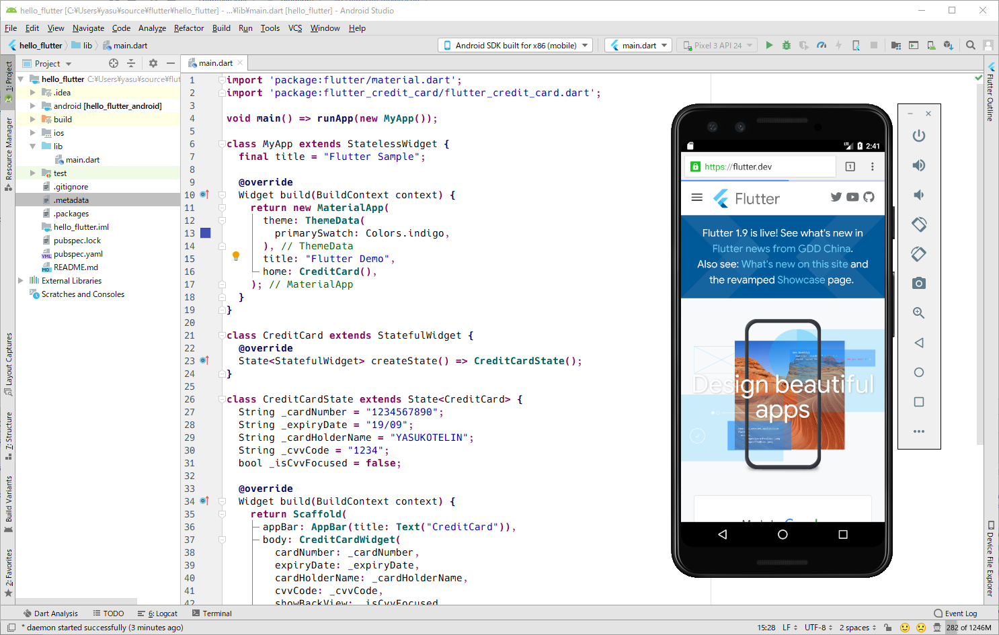

<h1 align="center">🎉 shirotelin for IntelliJ 🎉</h1>

shirotelin is Ultimate standard New Classical light colorscheme for IntelliJ

- [for Vim](https://github.com/yasukotelin/shirotelin)
- [for Visual Studio Code version](https://github.com/yasukotelin/shirotelin-vscode)

Ultimate standard light color scheme "shirotelin" is inspired by Eclipse, notepad++, InteliJ, Visual Studio, Hidemaru editor, sakura editor, and more⚡

So classical and so easy eye😆

## Author

yasukotelin
