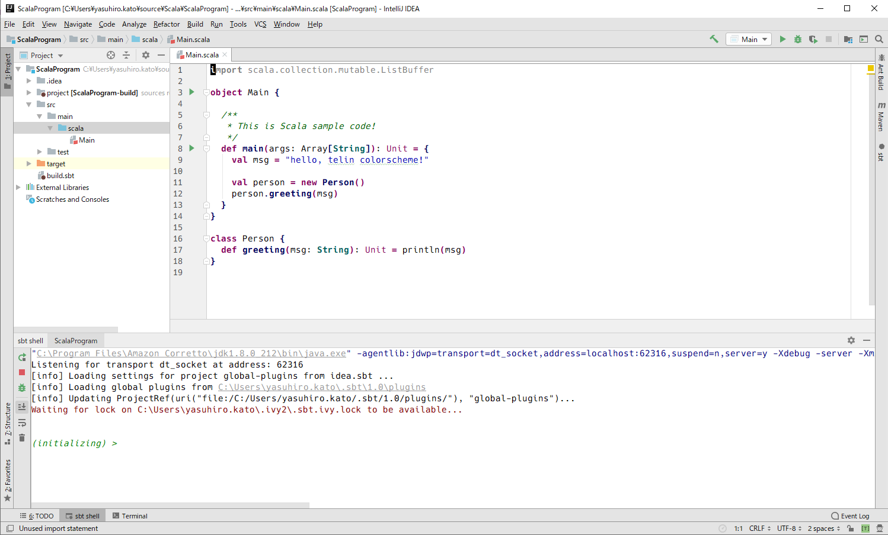
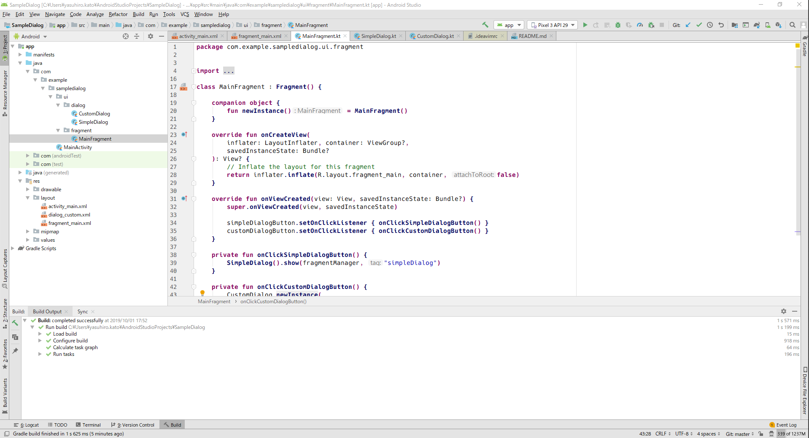
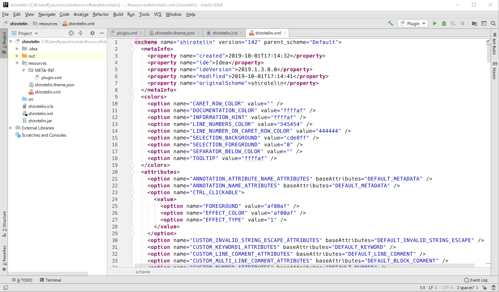

<h1 align="center">🎉 shirotelin for IntelliJ 🎉</h1>

shirotelin is Ultimate standard New Classical light colorscheme for IntelliJ!

> Original repository is vim plugin [shirotelin](https://github.com/yasukotelin/shirotelin)

Ultimate standard light color scheme "shirotelin" is inspired by Eclipse, notepad++, InteliJ, Visual Studio, Hidemaru editor, sakura editor, and more⚡

So classical and so easy eye😆

## Supported

Supported Idea IDE family! example IntelliJ, Android Studio.

## Screenshots

### Scala

### Android

### XML

## Author

yasukotelin
